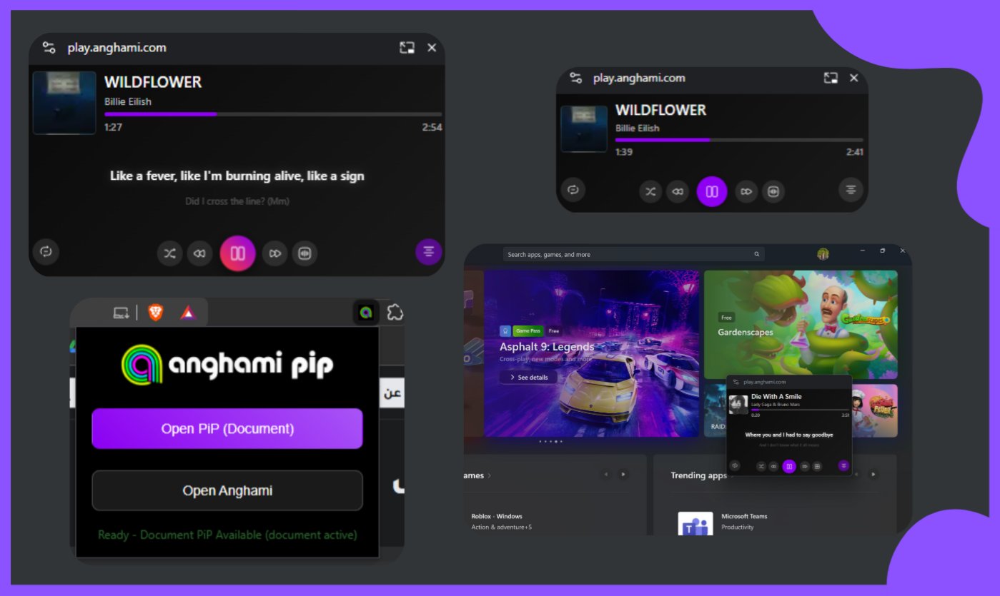

# 🎵 Anghami PiP Mini Player Extension



A Chrome extension that creates a **TRUE "Outside Browser" Picture-in-Picture window** for Anghami web using the Document Picture-in-Picture API. Built with **TypeScript** for enhanced reliability and maintainability.

[](https://www.typescriptlang.org/)
[](https://developer.chrome.com/docs/extensions/)
[](LICENSE)

## 🌟 **What Makes This Special**

Unlike traditional browser-based PiP solutions, this extension uses Chrome's **Document Picture-in-Picture API** to create a true system-level window that:

- **Works outside the browser** - Can be moved anywhere on your screen or other monitors
- **Always stays on top** - Remains visible over all applications, not just Chrome
- **Full HTML interface** - Interactive controls that work natively in the PiP window
- **Real-time synchronization** - Updates instantly as you interact with Anghami

## 🖼️ **Features**

- **Full HTML interface** in a system-level window like YouTube PiP
- **Interactive controls** - all buttons work natively in the PiP window
- **Always on top** of all applications, not just browser
- **Move anywhere** on screen, even to other monitors
- **Complete player** with cover art, progress bar, all controls
- **Keyboard shortcuts** work directly in the PiP window
- **Real-time sync** with main Anghami player
- **Smart DOM scraping** for accurate data extraction
- **Purple theme** - Modern UI with consistent purple branding (#8d00f2)
- **Minimum size constraints** - Prevents window from becoming too small (280x100px minimum)
- **Clean console output** - No verbose logging for production use
- **Robust error handling** - Graceful recovery from connection issues
- **Lyrics support** - Shows synchronized lyrics with smooth animations (⭐ **Anghami Plus required**)

> **Note**: Some features like lyrics display require an Anghami Plus subscription. See [Subscription Plan Limitations](#anghami-subscription-plan-limitations) for details.

## Main Features

### 🪟 Document Picture-in-Picture Window

- **System-level PiP window** using Chrome's Document PiP API
- **Always on top** of all applications, not just browser windows
- **Interactive HTML interface** - all controls work natively
- **Draggable and resizable** anywhere on screen or other monitors
- **True "outside browser" experience** like YouTube's PiP

### 🎮 Playback Controls

- **Play/Pause** - Controls Anghami's native playback
- **Next/Previous** - Skip tracks using Anghami's controls
- **Seek Support** - Click progress bar to seek to any position
- **Real-time sync** with the main Anghami player
- **Immediate UI feedback** - Button states update instantly on interaction

### ⭐ Additional Features

- **Like/Unlike** button with visual feedback
- **Shuffle** and **Repeat** mode toggles with immediate response
- **Real-time progress tracking** with smooth updates
- **Auto-update** track info when songs change
- **Consistent purple theming** throughout all components
- **Minimum size enforcement** - Window maintains usability at all sizes
- **Error recovery** - Handles connection issues gracefully

### 🎤 Lyrics Support (Anghami Plus Required)

> ⭐ **Anghami Plus subscription required for lyrics functionality**

- **Toggle lyrics display** with dedicated button
- **Current and next line view** - Shows current lyric with preview of next line
- **Hero morphing animations** - Smooth View Transitions API animations between lyrics
- **Smart duplicate handling** - Intelligent tracking for repeated lyrics
- **Responsive sizing** - Lyrics scale with window size
- **Auto-hide when unavailable** - Gracefully handles songs without lyrics
- **Real-time synchronization** - Lyrics update as the song plays

**Note**: If you're on Anghami's free plan, the lyrics button will be visible but lyrics won't be displayed. Consider upgrading to Anghami Plus to unlock this feature.

### ⌨️ Keyboard Shortcuts

- `Space` - Play/Pause
- `←` - Previous track
- `→` - Next track
- `L` - Toggle like
- `S` - Toggle shuffle
- `R` - Toggle repeat

### 🔄 Real-time Synchronization

- Uses MutationObserver to detect DOM changes
- Instantly updates when track changes
- Progress bar syncs with Anghami's progress indicator
- Button states reflect current player state

## Installation

### Prerequisites

- **Chrome 116+** or **Edge 116+** (Required for Document Picture-in-Picture API)
- **Anghami account** (Plus subscription recommended for full features)

### Option 1: From Source (Recommended for Development)

1. **Clone the repository**

   ```bash
   git clone https://github.com/KarimmYasser/anghami_pip_extension.git
   cd anghami_pip_extension
   ```

2. **Install dependencies**

   ```bash
   npm install
   ```

3. **Build the extension**

   ```bash
   npm run build
   ```

   This will:

   - Compile TypeScript files to JavaScript
   - Bundle with webpack
   - Copy all necessary files to the `dist/` folder

4. **Load in Chrome**

   - Open Chrome and navigate to `chrome://extensions/`
   - Enable "Developer mode" in the top right
   - Click "Load unpacked"
   - Select the `dist/` folder from the project directory

5. **Start using**
   - Navigate to [https://play.anghami.com](https://play.anghami.com)
   - Click the extension icon
   - Click "Open PiP" to launch the mini player

### Option 2: Install Pre-built Extension

1. Download the latest release from the [Releases page](https://github.com/KarimmYasser/anghami_pip_extension/releases)
2. Extract the ZIP file
3. Follow steps 4-5 from Option 1 above

## 🛠️ Development

### Tech Stack

- **TypeScript 5.9.3** - Type-safe development
- **Webpack 5** - Module bundling
- **Chrome Extension Manifest V3** - Latest extension standard
- **Document Picture-in-Picture API** - System-level PiP windows

### Project Structure

```
anghami_pip_extension/
├── dist/                    # Built extension (generated)
│   ├── content.js
│   ├── document-pip.js
│   ├── popup.js
│   ├── manifest.json
│   ├── popup.html
│   ├── styles.css
│   └── icons/
├── src/ (TypeScript source files at root)
│   ├── content.ts           # Main scraper and PiP manager
│   ├── document-pip.ts      # Document PiP window implementation
│   ├── popup.ts             # Extension popup logic
│   └── types.d.ts           # TypeScript type definitions
├── manifest.json            # Extension manifest
├── popup.html               # Popup UI
├── styles.css               # Styling and theme
├── icons/                   # Extension icons
├── webpack.config.js        # Webpack configuration
├── tsconfig.json           # TypeScript configuration
├── package.json            # Dependencies and scripts
├── README.md               # This file
└── TROUBLESHOOTING.md      # Detailed troubleshooting guide
```

### Build Scripts

```bash
# Development build with source maps
npm run build

# Watch mode for development
npm run watch

# Production build (minified)
npm run webpack

# TypeScript watch mode
npm run watch:ts

# Clean build artifacts
npm run clean
```

### Key Classes

#### `AnghamiScraper` (content.ts)

- Extracts track data from Anghami's DOM
- Manages MutationObservers for real-time updates
- Controls playback through DOM manipulation
- Handles lyrics extraction and synchronization

#### `AnghamiDocumentPiP` (document-pip.ts)

- Creates and manages the Document PiP window
- Renders interactive HTML interface
- Handles user interactions in PiP window
- Syncs state with main Anghami player

#### `PiPModeManager` (content.ts)

- Detects available PiP modes
- Manages PiP lifecycle
- Handles fallback strategies

#### `ConnectionManager` (content.ts)

- Health monitoring and auto-recovery
- Retry logic for failed connections
- Graceful error handling

### Type Definitions

All types are defined in `types.d.ts`:

- `TrackData` - Song metadata interface
- `LyricsData` - Lyrics structure
- `AnghamiScraper` - Scraper interface
- Window extensions for global objects

### Adding New Features

1. **Add type definitions** in `types.d.ts`
2. **Implement scraper logic** in `content.ts`
3. **Update PiP UI** in `document-pip.ts`
4. **Add event handlers** for new controls
5. **Build and test**: `npm run build`

## Project File Structure

### Complete Project Layout

```
anghami_pip_extension/
├── dist/                      # Build output (generated by npm run build)
│   ├── manifest.json          # Copied from root
│   ├── content.js             # Compiled from content.ts
│   ├── content.js.map         # Source map for content.ts
│   ├── document-pip.js        # Compiled from document-pip.ts
│   ├── document-pip.js.map    # Source map for document-pip.ts
│   ├── popup.js               # Compiled from popup.ts
│   ├── popup.js.map           # Source map for popup.ts
│   ├── popup.html             # Copied from root
│   ├── styles.css             # Copied from root
│   └── icons/                 # Copied from root
│       ├── icon16.png
│       ├── icon32.png
│       ├── icon48.png
│       ├── icon128.png
│       └── ... (other icons)
│
├── icons/                     # Extension icons (source)
│   ├── icon16.png
│   ├── icon32.png
│   ├── icon48.png
│   ├── icon128.png
│   └── ... (player control icons)
│
├── node_modules/              # npm dependencies (generated)
│
├── content.ts                 # Main scraper and PiP manager (TypeScript source)
├── document-pip.ts            # Document PiP window implementation (TypeScript source)
├── popup.ts                   # Extension popup logic (TypeScript source)
├── types.d.ts                 # TypeScript type definitions
│
├── manifest.json              # Extension manifest (Manifest V3)
├── popup.html                 # Extension popup UI
├── styles.css                 # Styling and purple theme
├── player-wrapper.html        # PiP window template
│
├── webpack.config.js          # Webpack bundling configuration
├── tsconfig.json              # TypeScript compiler configuration
├── package.json               # npm dependencies and scripts
├── package-lock.json          # npm dependency lock file
│
├── README.md                  # This file
├── TROUBLESHOOTING.md         # Detailed troubleshooting guide
└── LICENSE                    # MIT License
```

### Key Files Explained

#### TypeScript Source Files (Root)

- **`content.ts`** - Main content script with AnghamiScraper, PiPModeManager, ConnectionManager classes
- **`document-pip.ts`** - Document PiP window creation and management
- **`popup.ts`** - Extension popup UI logic
- **`types.d.ts`** - Shared TypeScript interfaces (TrackData, LyricsData, etc.)

#### Static Assets (Root)

- **`manifest.json`** - Chrome extension configuration (Manifest V3)
- **`popup.html`** - Extension popup interface
- **`styles.css`** - Purple theme and CSS variables
- **`player-wrapper.html`** - HTML template for PiP window
- **`icons/`** - All extension and player control icons

#### Build Configuration

- **`webpack.config.js`** - Bundles TypeScript and copies static assets to dist/
- **`tsconfig.json`** - TypeScript compiler settings (strict mode, ES2020 target)
- **`package.json`** - Dependencies and build scripts

#### Generated Files (dist/)

All files in `dist/` are automatically generated by `npm run build`:

- **`.js` files** - Compiled from `.ts` source files
- **`.js.map` files** - Source maps for debugging
- **Static assets** - Copied from root (manifest, HTML, CSS, icons)

> **Important**: Load the **`dist/`** folder as an unpacked extension in Chrome, not the root folder!

## 🚀 Quick Start

1. **Build the extension**: `npm run build`
2. **Load in Chrome**: Load unpacked from `dist/` folder
3. **Open Anghami**: Navigate to [play.anghami.com](https://play.anghami.com)
4. **Launch PiP**: Click extension icon → "Open PiP"
5. **Enjoy**: Control your music from anywhere!

## Technical Implementation

### Architecture

- **TypeScript 5.9.3** - Fully typed codebase for reliability
- **Webpack 5** - Module bundling with source maps
- **Manifest V3** - Latest Chrome extension standard
- **Document Picture-in-Picture API** - System-level PiP windows
- **MutationObserver** - Real-time DOM change detection
- **Chrome Storage API** - State persistence

### Build Pipeline

1. **TypeScript Compilation**: `.ts` → `.js` with type checking
2. **Webpack Bundling**: Module resolution and optimization
3. **Asset Copying**: Static files (manifest, HTML, CSS, icons) → `dist/`
4. **Source Maps**: Generated for debugging

### Communication Flow

```
Anghami Page (DOM)
        ↓
  AnghamiScraper
  (extracts data)
        ↓
  PiPModeManager
  (manages modes)
        ↓
AnghamiDocumentPiP
(renders UI)
        ↓
Document PiP Window
(user interaction)
        ↓
  Event Handlers
        ↓
  Anghami Page (DOM)
  (simulates clicks)
```

### DOM Scraping Strategy

The extension uses intelligent DOM scraping to extract data:

- **Track metadata** from `.track-info` sections with fallbacks
- **Progress** from `.stream-controls.indicator` positioning
- **Play state** from button visibility and CSS classes
- **Lyrics** from `.mini-lyrics-holder` with duplicate handling
- **Control buttons** for interaction simulation

### Error Handling & Recovery

- **Health monitoring**: Periodic checks for component availability
- **Auto-retry logic**: Exponential backoff for failed connections
- **Graceful degradation**: Shows error messages instead of crashing
- **State recovery**: Reinitializes on page navigation
- **Console logging**: Comprehensive debugging with emoji indicators

### Key Features Implementation

#### Real-time Synchronization

- **MutationObserver**: Watches DOM for changes
- **Debounced updates**: Prevents excessive re-renders
- **Smart diffing**: Only updates changed properties

#### Lyrics Display

- **View Transitions API**: Smooth morphing animations
- **Smart indexing**: Handles duplicate lyrics intelligently
- **Fallback rendering**: Works without View Transitions
- **Auto-hide**: Hides when lyrics unavailable

#### Repeat Button Fix

- **State-driven UI**: Visual state follows data state
- **Post-toggle extraction**: Re-extracts state after 100ms
- **Proper sync**: No more toggle conflicts

#### Connection Management

- **Health checks**: Periodic validation every 10s
- **Retry mechanism**: Up to 5 retries with exponential backoff
- **Status reporting**: Reports health to popup

## 📖 Documentation

- **[TROUBLESHOOTING.md](TROUBLESHOOTING.md)** - Comprehensive troubleshooting guide
  - Browser compatibility checks
  - Console log interpretation
  - Lyrics loading issues
  - Repeat button problems
  - Common error solutions

## 🐛 Troubleshooting

For detailed troubleshooting, see **[TROUBLESHOOTING.md](TROUBLESHOOTING.md)**.

### Quick Fixes

**No PiP mode available**

- Ensure Chrome 116+ or Edge 116+
- Check console for `✅ Document PiP API detected`
- Reload extension and refresh Anghami page

**Stuck at "Loading lyrics"**

- Open lyrics on main Anghami page first
- Check console for `🎵 Lyrics detected`
- Not all songs have lyrics
- Requires Anghami Plus subscription

**Repeat button not showing color**

- Fixed in latest version
- Button updates after 100ms delay
- Check console for `Repeat mode updated to: ...`

**Extension not loading**

- Run `npm run build` to build the extension
- Check `dist/` folder contains all files
- Ensure `manifest.json` exists in `dist/`

### Debug Mode

Open the browser console (F12) on the Anghami page to see detailed logs:

```
✅ Document PiP class loaded and instantiated
🔄 Starting extension initialization...
✅ Scraper ready
✅ PiP Mode Manager initialized
🎵 Lyrics detected: {totalLines: 45, ...}
📝 Lyrics update check: {...}
```

## 🌐 Browser Support

| Browser        | Version | Document PiP       | Status                 |
| -------------- | ------- | ------------------ | ---------------------- |
| **Chrome**     | 116+    | ✅ Full Support    | ✅ **Recommended**     |
| **Chrome**     | 120+    | ✅ Latest Features | ✅ **Best Experience** |
| **Edge**       | 116+    | ✅ Full Support    | ✅ Recommended         |
| **Brave**      | Varies  | ⚠️ Limited         | ⚠️ May not work        |
| Other Chromium | Varies  | ⚠️ Variable        | ⚠️ Test first          |

### How to Check Your Browser Version

1. Open Chrome/Edge
2. Go to `chrome://version/` or `edge://version/`
3. Check the version number (first line)
4. Ensure it's **116 or higher**

## 🔒 Permissions & Privacy

### Permissions Used

- `scripting` - Inject content scripts into Anghami pages
- `activeTab` - Access current tab for extension functionality
- `host_permissions` - Access Anghami domains
  - `https://play.anghami.com/*`
  - `https://*.anghami.com/*`

### Privacy Commitment

- ✅ **No data collection** - Extension works entirely locally
- ✅ **No external requests** - Uses only Anghami's existing APIs
- ✅ **No tracking** - No analytics or telemetry
- ✅ **No storage of personal data** - Only stores UI state
- ✅ **Open source** - Code is publicly auditable

The Document Picture-in-Picture API requires no additional permissions beyond standard content script access.

## ⚠️ Limitations

### Technical Limitations

- ✋ Only works on Anghami web player (`play.anghami.com`)
- ✋ Requires JavaScript to be enabled
- ✋ Dependent on Anghami's DOM structure (may break with UI updates)
- ✋ No offline functionality
- ✋ Requires Chrome 116+ or Edge 116+

### Anghami Subscription Plan Limitations

Some features require an **Anghami Plus subscription**:

| Feature                  | Free Plan  | Anghami Plus |
| ------------------------ | ---------- | ------------ |
| Basic Playback Controls  | ✅ Yes     | ✅ Yes       |
| Track Information        | ✅ Yes     | ✅ Yes       |
| Progress Bar             | ✅ Yes     | ✅ Yes       |
| Play/Pause/Next/Previous | ✅ Yes     | ✅ Yes       |
| **Lyrics Display**       | ❌ No      | ✅ Yes       |
| Shuffle/Repeat           | ✅ Limited | ✅ Yes       |
| Like/Unlike Tracks       | ✅ Yes     | ✅ Yes       |

**Note**: The lyrics button will be visible to all users, but lyrics will only display for Anghami Plus subscribers.

## 🤝 Contributing

Contributions are welcome! Here's how you can help:

1. **Fork** the repository
2. **Create** a feature branch: `git checkout -b feature/amazing-feature`
3. **Commit** your changes: `git commit -m 'Add amazing feature'`
4. **Push** to the branch: `git push origin feature/amazing-feature`
5. **Open** a Pull Request

### Development Guidelines

- Follow TypeScript best practices
- Add types for new interfaces
- Include console logs with emoji indicators
- Test on Chrome 116+ before submitting
- Update documentation for new features

## 📝 Changelog

### v1.1.0 (Latest)

- ✅ Migrated to TypeScript for type safety
- ✅ Added comprehensive error handling
- ✅ Fixed repeat button not showing active state
- ✅ Fixed lyrics loading issues (proper interface usage)
- ✅ Added connection health monitoring
- ✅ Improved console logging with emojis
- ✅ Added TROUBLESHOOTING.md guide
- ✅ Enhanced build pipeline with webpack

### v1.0.0

- 🎉 Initial release
- ✨ Document Picture-in-Picture support
- 🎨 Purple theme
- 🎵 Lyrics display
- ⌨️ Keyboard shortcuts

## 📄 License

This project is licensed under the MIT License - see the [LICENSE](LICENSE) file for details.

## 🙏 Acknowledgments

- **Anghami** - For the amazing music streaming service
- **Chrome DevRel** - For the Document Picture-in-Picture API
- **TypeScript Team** - For the excellent type system

## ⚖️ Disclaimer

This extension is an independent project and is not affiliated with, endorsed by, or officially connected with Anghami Inc. in any way. Anghami and the Anghami logo are trademarks of Anghami Inc.

This extension is provided "as is" for educational and personal use. The extension works by analyzing Anghami's DOM structure and may break if Anghami updates their interface.

---

**Made with ❤️ by [KarimmYasser](https://github.com/KarimmYasser)**

**Star ⭐ this repo if you find it useful!**
